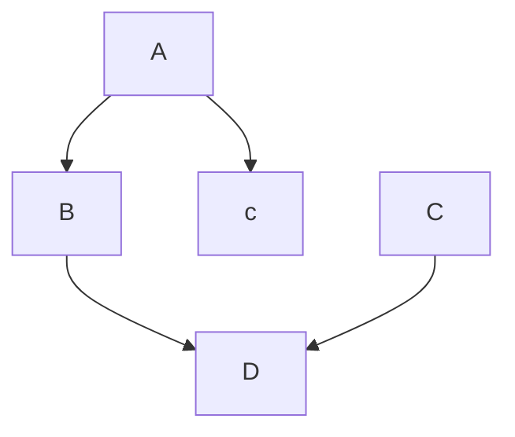

# Full-stack

sequenceDiagram
    participant browser
    participant server

    browser->>server: GET https://studies.cs.helsinki.fi/exampleapp/notes
    activate server
    server-->>broser: HTML document
    deactivate server

    browser->>server: GET https://studies.cs.helsinki.fi/exampleapp/main.css
    activate server
    server-->>browser: the css file
    deactivate server

    browser->>server: GET https://studies.cs.helsinki.fi/exampleapp/main/js
    activate server
    browser->>server: the Javascript file
    deactivate server

    Note right of browser: The browser starts executing the Javascript code that fetches the JSON from the server 

    browser->>server: GET https://studies.cs.helsinki.fi/exampleapp/data.json
    activate server
    server-->>browser: [{"content":"HTML is easy", "data": "2023-1-1", ...}]
    deactivate server

    Note right of browser: The browser executes the callback function that renders the notes
